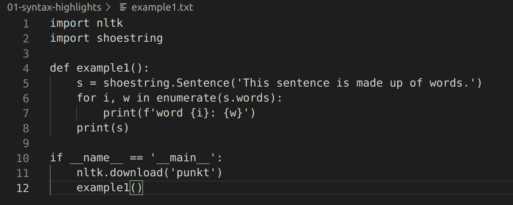
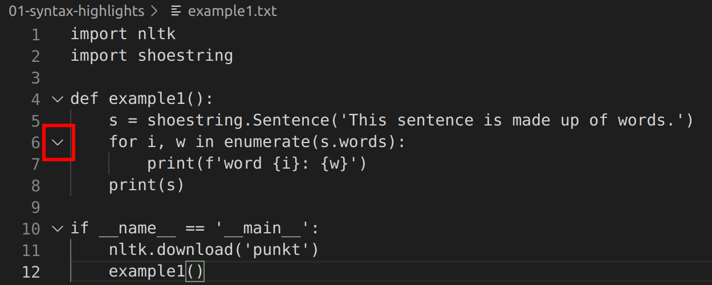
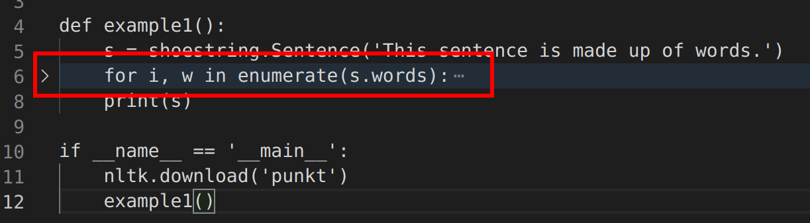
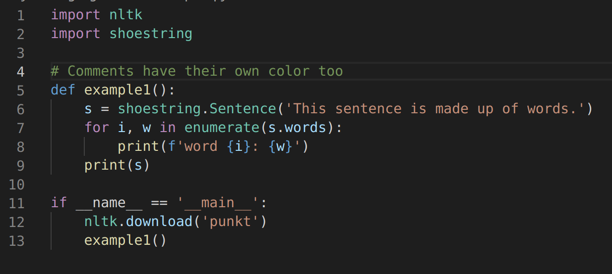
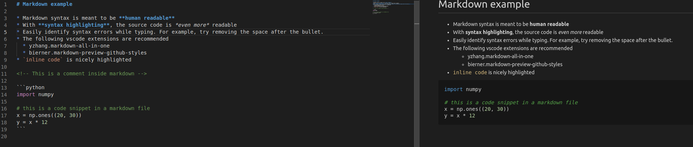

# Basic UI & Syntax highlights

## What is an IDE?

An [IDE](https://en.wikipedia.org/wiki/Integrated_development_environment)
is an *Integrated Development Environment*. The "integrated" is a big hint:
IDEs combine tools that *edit* code (a text editor) in the same package with
tools that *process* code (like an interpreter or compiler). Modern IDEs even
integrated [debugging](https://code.visualstudio.com/docs/editor/debugging),
[version control](https://code.visualstudio.com/docs/editor/github),
[deployment](https://code.visualstudio.com/nodejs-deployment),
and [terminal access](https://code.visualstudio.com/docs/editor/integrated-terminal).

When the tool you use to write code can also understand the code, it can support
you in ways that make your life much, much easier.

## UI Overview

IDEs like VS Code offer a lot of different functions. Here's a guide to their names:

(The "status bar" refers to the blue bar at the bottom of the window.)

For much more detail, see the
[official VS Code UI documentation](https://code.visualstudio.com/docs/getstarted/userinterface).

## Text editing

[This file with a .txt extension](./assets/without_syntax_highlighting.txt) actually contains
Python code. (We've changed the extension so that VS Code will show only the basic text
editing features). Here's what you get:

Already there's a lot of nice features to help with focus:

* **Vertical bars** let you visualize different indent levels
* **Line numbers** help you stay organized
* **Horizontal highlights** draw focus to the line where the cursor is, and show edit history

You can even hide sections you aren't working on by using the arrows in the margin:

If you click the highlighted caret, this collapses everything below that indent level, leaving:

These are nice for editing text. But the IDE will really shine when you use language-specific features.

## Syntax highlights

If you have an appropriate [extension](https://code.visualstudio.com/api/language-extensions/overview)
installed for the language you're working with, VS Code can provide
language-specific features based on the file's suffix. For instance,
[the .py says this is a Python file](./assets/with_syntax_highlighting.py).

When we open it, we get **syntax highlights**:

The colors and styling
show you how the interpreter or compiler will understand each word: whether it's
a [language keyword](https://en.wikipedia.org/wiki/Reserved_word)
or a [symbol](https://en.wikipedia.org/wiki/Identifier_(computer_languages)),
or even just a code comment.

Features vary based on the language. For instance, with a
[markdown file](./assets/markdown-example.md),
the highlights in the editor try to mimic the final format.
VS Code will also preview the actual rendered Markdown in another pane, too:

There are extensions providing resources for everything from
[assembly](https://marketplace.visualstudio.com/items?itemName=13xforever.language-x86-64-assembly)
to [ZIL](https://marketplace.visualstudio.com/items?itemName=zilf.zil-language), from
[LaTeX](https://marketplace.visualstudio.com/items?itemName=James-Yu.latex-workshop) to
[Lisp](https://marketplace.visualstudio.com/items?itemName=mattn.Lisp), and even for obscure
languages like [Python](https://en.wikipedia.org/wiki/Python_(programming_language)),
[C](https://en.wikipedia.org/wiki/C_(programming_language)), and
[JavaScript](https://en.wikipedia.org/wiki/JavaScript).

Later on, we'll discuss even more
[static program analysis](https://en.wikipedia.org/wiki/Static_program_analysis)
features that provide advanced refactoring functionality. Remember, the IDE
*understands* your code as you write it, so it lets you edit intelligently.

One way it can help is by highlighting problems in real time.
