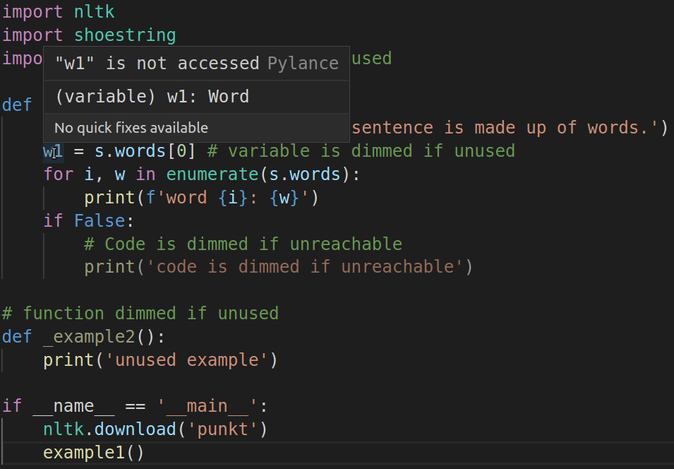
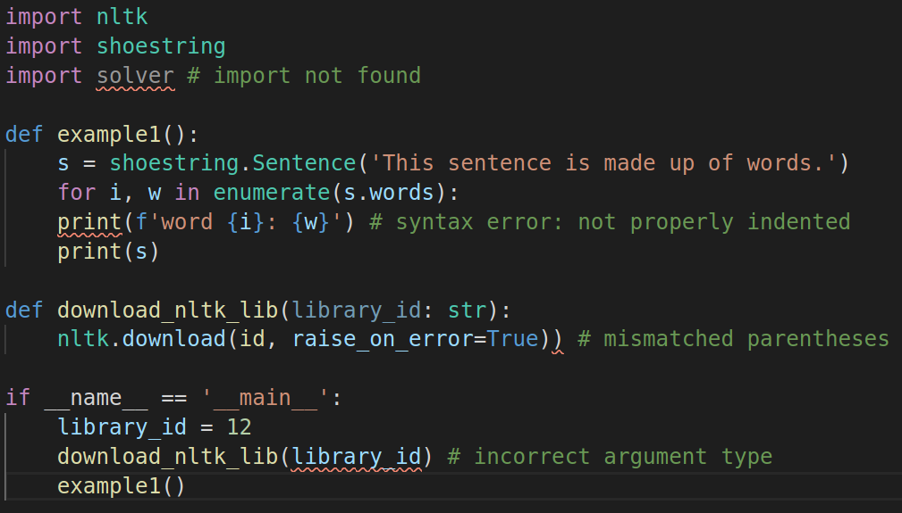
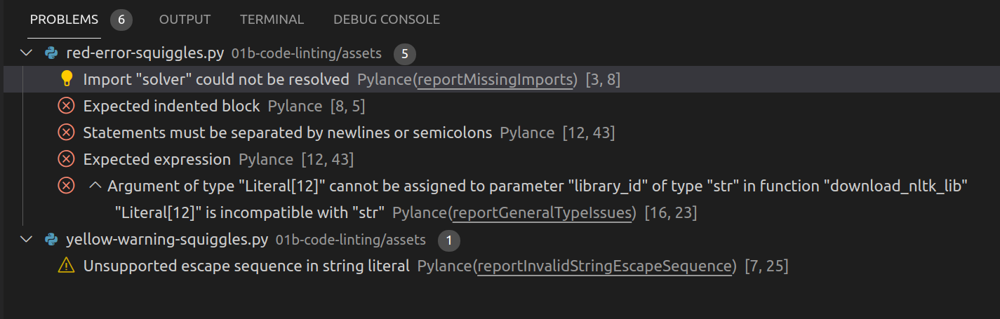

# Code linting

A linter is used to find errors, warnings, or stylistic problems in source code before compilation or runtime. When a linter is integrated with an IDE (such as VS Code), this is all done in real time as you type, and the results of linting are shown in a variety of ways.

The term "lint" comes from software used by Bell Labs starting in 1978 that found small defects in code, just like a dryer finds small pieces of lint in clothes ([see wikipedia article](https://en.wikipedia.org/wiki/Lint_(software))).

<!--  -->
<!-- While the native Markdown link inclusion doesn't include the width styling, it looks like Github wasn't honoring that anyway. -->

## Greyed out (dimmed) code warnings

With the proper configuration, VS Code will warn about unused or unreachable code by greying out (or dimming) Python code in the following cases:

* Unused imports
* Unused variables
* Unreachable code
* Unused functions

<!--  -->

Mouse hover over a greyed out word to get info about the warning:

<!--  -->

See [dimmed-code-warnings.py](./assets/dimmed-code-warnings.py)

## Error squiggles

Errors in Python code are indicated with red squiggles in the following cases:

* Import not found
* Syntax error
* Incorrect argument type (when using static type hints)
* Mismatched parentheses or quotes
* etc.

<!--  -->

See [red-error-squiggles.py](./assets/red-error-squiggles.py)

Warnings are indicated with yellow squiggles.

<!--  -->

See [yellow-warning-squiggles.py](./assets/yellow-warning-squiggles.py)

Other color squiggles can indicate other problems such as unrecommended code constructs or styles.

## File explorer - highlighting of errors/warnings

Open files with errors or warnings are highlighted in red or yellow in the file explorer.

<!--  -->

## 'PROBLEMS' tab

Errors and warnings for open files are also listed in the PROBLEMS tab in the terminal area.

<!--  -->
